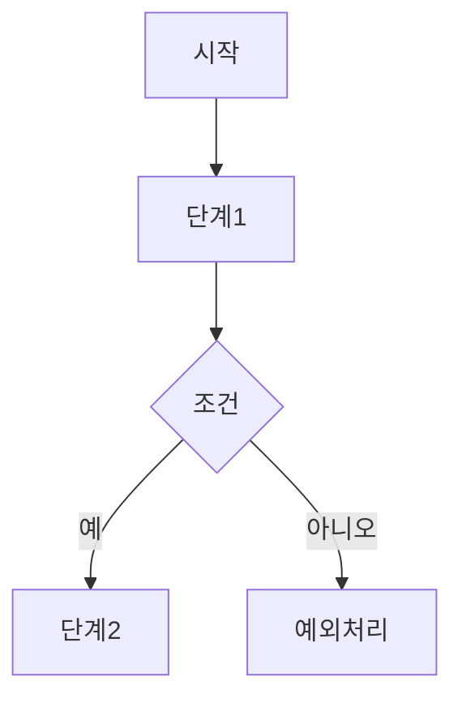

# AWS DEVCRAFT Agent 예시 가이드

## 좋은 질문 예시

### 초기 접근

❌ **나쁜 예**: "Lambda와 Step Functions를 사용해서 뭔가 만들어보세요"
✅ **좋은 예**: "온라인 쇼핑몰에서 주문 처리 과정을 자동화하고 싶어요"

### 요구사항 수집 질문들

- "주문이 들어왔을 때 어떤 단계들을 거쳐야 하나요?"
- "결제 실패나 재고 부족 같은 예외 상황은 어떻게 처리하시나요?"
- "하루에 몇 개 정도의 주문을 처리하시나요?"
- "다른 시스템과 연동이 필요한가요?"

## 문서화 예시

### requirements.md 구조

```markdown
# 프로젝트 요구사항

## 프로젝트 개요
- 목적: 
- 사용자: 
- 문제점: 

## 기능 요구사항
1. 
2. 
3. 

## 비기능 요구사항
- 성능: 
- 보안: 
- 가용성: 

## 제약사항
- 예산: 
- 시간: 
- 기술: 
```

### workflow.md 구조

```markdown
# 워크플로우 다이어그램

## 프로세스 개요
[프로세스 설명]

## 워크플로우 다이어그램


## 단계별 설명

1. **시작**:
2. **단계1**:
3. **조건**:

```

## ASL 생성 가이드

### JSONata 기반 ASL 예시
```json
{
  "Comment": "주문 처리 워크플로우",
  "QueryLanguage": "JSONata",
  "StartAt": "ValidateOrder",
  "States": {
    "ValidateOrder": {
      "Type": "Task",
      "Resource": "arn:aws:lambda:region:account:function:ValidateOrder",
      "Next": "ProcessPayment"
    }
  }
}
```
