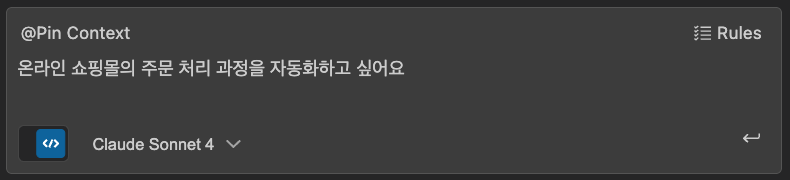
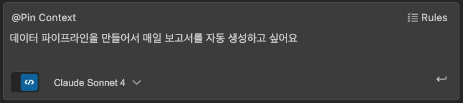

# AWS DEVCRAFT Agent

AWS Step Functions State Machine과 Amazon States Language 구현을 전문적으로 지원하는 AI 에이전트입니다.

## 주요 기능

- **요구사항 수집**: 사용자의 비즈니스 요구사항을 체계적으로 파악
- **워크플로우 설계**: Mermaid 다이어그램으로 프로세스 시각화
- **ASL 생성**: JSONata 기반 Amazon States Language 정의서 작성
- **AWS 기술 조언**: 전문적인 AWS 서비스 활용 가이드

## 사용 방법

1. **프로젝트 클론**

   ```bash
   git clone <repository-url> <your-project-folder>
   cd your-project-folder
   ```

2. **Amazon Q에서 사용**
   - Amazon Q IDE 플러그인에서 이 프로젝트 폴더 열기
   - 채팅에서 "만들고 싶은 기능이나 해결하고 싶은 문제를 알려주세요"로 시작

3. **에이전트와 상호작용**
   - 비즈니스 요구사항 설명
   - 단계별 질문에 답변
   - 생성된 문서 검토 및 승인

## 생성되는 문서

- `docs/requirements.md`: 요구사항 명세서
- `docs/workflow.md`: 워크플로우 다이어그램
- `docs/implementation.md`: AWS Step Functions 구현 계획
- `workflow.asl.json`: Amazon States Language 정의서 (프로젝트 루트)

## 에이전트 특징

- **사용자 중심 접근**: AWS 서비스를 먼저 제안하지 않고 요구사항부터 파악
- **체계적 문서화**: 모든 과정을 단계별로 문서화
- **전문적 조언**: MCP 서버 도구를 활용한 최신 기술 정보 제공
- **실용적 구현**: 실제 배포 가능한 ASL 코드 생성

## 시작하기

VS Code에서 Amazon Q Developer에게 다음과 같이 말해보세요:




에이전트가 단계별로 요구사항을 파악하고 최적의 솔루션을 제안해드립니다.
